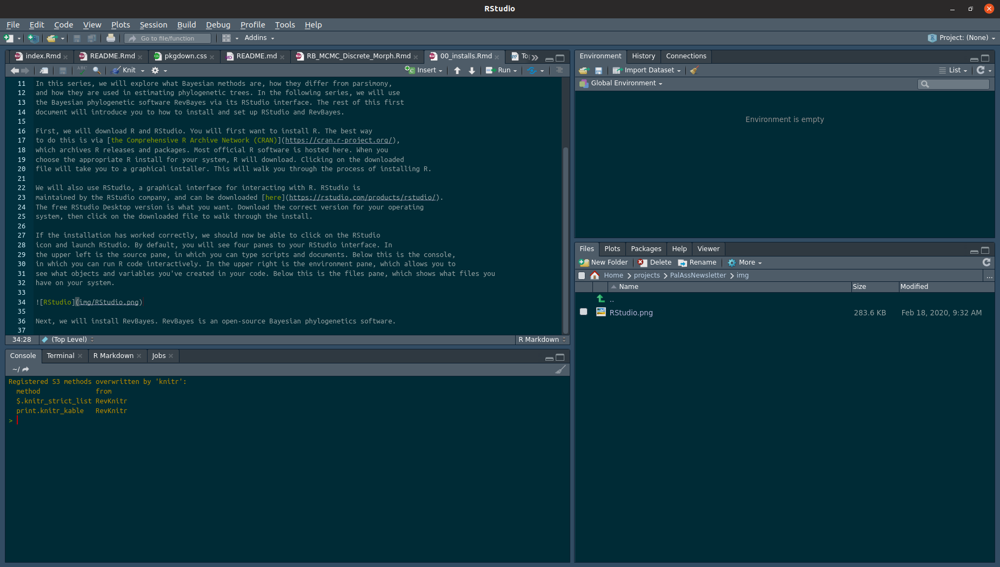

Very few controversies in paleontology have set passions alight like how to best build a 
tree. The most obvious manifestation of this is in the argument of whether to use Bayesian
or parsimony methods to estimate a tree. But we also see this controversy in the exact 
type of parsimony to use, and why.

In this series, we will explore what Bayesian methods are, how they differ from parsimony,
and how they are used in estimating phylogenetic trees. In the following series, we will use 
the Bayesian phylogenetic software RevBayes via its RStudio interface. The rest of this first 
document will introduce you to how to install and set up RStudio and RevBayes.

First, we will download R and RStudio. You will first want to install R. The best way 
to do this is via [the Comprehensive R Archive Network (CRAN)](https://cran.r-project.org/),
which archives R releases and packages. Most official R software is hosted here. When you
choose the appropriate R install for your system, R will download. Clicking on the downloaded
file will take you to a graphical installer. This will walk you through the process of installing R.

We will also use RStudio, a graphical interface for interacting with R. RStudio is
maintained by the RStudio company, and can be downloaded [here](https://rstudio.com/products/rstudio/).
The free RStudio Desktop version is what you want. Download the correct version for your operating 
system, then click on the downloaded file to walk through the install.

If the installation has worked correctly, we should now be able to click on the RStudio 
icon and launch RStudio. By default, you will see four panes to your RStudio interface. In
the upper left is the source pane, in which you can type scripts and documents. Below this is the console,
in which you can run R code interactively. In the upper right is the environment pane, which allows you to
see what objects and variables you've created in your code. Below this is the files pane, which shows what files you
have on your system. The color scheme of RStudio can be manipulated under `Tools > Global Options`.



To make sure everything is working as expected, we will try installing an R package. Under `Tools`, choose `Install Packages`. Enter `devtools` as the package to install. By default, `Install dependencies` should be checked. If not, check it. This will install a package called `devtools`, which has some advanced options for R packages. 

Next, we will install RevBayes. RevBayes is an open-source Bayesian phylogenetics software. It can be installed from [here](https://revbayes.github.io/download). One additional step you might consider doing is adding RevBayes to your system path. This allows the software to be executed from anywhere, and by RStudio. Instructions for doing this on Windows are [here](https://docs.microsoft.com/en-us/previous-versions/office/developer/sharepoint-2010/ee537574(v=office.14)) and [here](https://www.architectryan.com/2012/10/02/add-to-the-path-on-mac-os-x-mountain-lion/) for Mac. This step is not essential, but may make life easier later. 

Finally, we will install RevKnitR, RevBayes' RStudio interface. In the console, type:

```{r}
devtools::install_github("revbayes/RevKnitR@final_rb")
```
 This step may ask you to update some packages, depdending on the age of your install. Allow this.
 
 That's all for this installment. Next time: What is a Bayesian method, anyway? 

