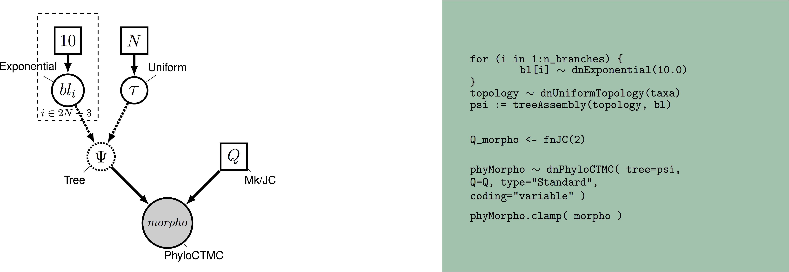

## Recap

Last session, we loaded a data matrix into RevBayes and gethered some simple facts about the dataset, such as how much missing data we have. Today, we'll be looking at setting up a simple Bayesian model to estimate phylogeny.

## Overview of Discrete Morphology Models

 
_Graphical model showing the Mk model (left panel)._ 
_Rev code specifying the Mk model is on the right-hand panel._

As technologies for obtaining low-cost and high-throughput nucleotide sequence data have become available, many scientists have become reliant on molecular data for phylogenetics. However, morphological data remain the only direct observations we have of most extinct organisms, and are an independent data source for understanding phylogeny. Many of the phylogenetic methods we will discuss in this tutorial were invented for use with sequence data. However, these methods are still very useful for discrete morphological data. We will examine some common assumptions for modeling data in a phylogenetic context, then move on to look at relaxing these assumptions.

Modeling discrete morphological data requires an understanding of the underlying properties of the data. When we work with molecular data, we know _a priori_ that certain types of changes are more likely than other. For example, changes within a type of base (purine and pyrimidine) are much more likely than changes between types of bases. This information can be used to add parameters to the phylogenetic model. There are not equivelant and generalizeable truths across characters in a morphological data matrix. For example, while `0` and `1` are commonly coded to "presence" and "absence."  However, this is not always the case. Nor are all characters atomized at the same magnitude. For example, at one character, changing character states may not reflect a large amount of genetic changes. Theca shape (character 2 in the Zamora et al. 2013 dataset), for example appears quite labile. At another, the changes to the character state may reflect a rearrangement of genetic elements, or might have larger ramifications for the organism's life and behavior. Character 38, the central plate of the lintel, may be one such character, as it changes seldom.

When we work with morphological data in a Bayesian context, we are performing these analyses after a long history of workers performing phylogenetic analysis in a maximum parsimony framework. Under maximum parsimony, trees are proposed. The number of changes in the data implied by the tree are then counted. The tree implying the fewest changes is considered the best. There may be multiple most parsimonious trees in a dataset. Parsimony has been the dominant method for estimating phylogenetic trees from discrete morphological data. Characters that cannot be used to discriminate between tree topologies are not typically collected by workers using parsimony. For example, characters that do not vary are not collected, as they all have the same length (0 steps) on a tree. Likewise, autapomorphies are typically not collected. As we will see later, this has ramifications for how we model the data. 

For many years, parsimony was the only way to estimate a phylogenetic tree from morphological data. In 2001, Paul Lewis published the Mk model of morphological evolution. The Mk model [@Lewis2001] is a generalizationof the Jukes-Cantor model [@Jukes1969] of nucleotide sequence evolution. This model, while simple, has allowed researchers to access the toolkit of phylogenetic methods available to researchers working with other discretely-valued data, such as nulceotides or amino acids.


## The Mk Model 

As mentioned above, the Mk model is a generalization of the JC model. This model assumes that all transitions between character states are equal, and that all characters in the matrix have the same transition matrix. The transition matrix for a binary trait looks like so: 

$$Q = \begin{pmatrix} -\mu_0 & \mu_{01} \\
\mu_{10} & -\mu_1  &\\
\end{pmatrix} \mbox{  ,}$$


In this matrix, $\mu$ represents the transition probability between the two states that follow it. A transition matrix for multistate data simply expands.

$$Q = \begin{pmatrix} -\mu_0 & \mu_{01} & \mu_{02} & \mu_{03} \\
\mu_{10} & -\mu_1  & \mu_{12} & \mu_{13} \\
\mu_{20} & \mu_{21} & -\mu_2  & \mu_{23} \\
\mu_{30} & \mu_{31} & \mu_{32} & -\mu_3 
\end{pmatrix} \mbox{  ,}$$

However, the Mk model sets transitions to be equal from any state to any other state. In that sense, our multistate matrix really looks like this:

$$Q = \begin{pmatrix} -(k-1)\mu & \mu & \mu & \mu \\
\mu & -(k-1)\mu  & \mu & \mu \\
\mu & \mu & -(k-1)\mu  & \mu \\
\mu & \mu & \mu & -(k-1)\mu \\
\end{pmatrix} \mbox{  ,}$$

You might notice that these transition rates are not different than what we might expect from an equal-weights parsimony matrix. In practice, the Mk model makes very few assumptions due to the complexity and non-generalizeability of morphological data. 

This model may strike some readers as too simplistic to be adequate for morphological data. However, Bayesian methods are less likely to be mislead by homoplasy than is parsimony [@Felsenstein1983]. More recent work has demonstrated that the model outperforms parsimony in many situations, particularly those in which there is high homoplasy [@Wright2014], with empirical work demonstrating that it fits many datasets reasonably well [@Wright2016]. 

In the first part of this tutorial, we will estimate a tree under the Mk model as proposed by Lewis (2001). We will then relax core parameters of the model.

## Ascertainment Bias 

One remaining component of the model we have not yet discussed is ascertainment bias. Because workers using parsimony do not collect invariant characters and seldom collect autapomorphies, our data are _biased_. Imagine, for a moment, that you were to measure the average height in a room. But first, you asked the 10 shortest people to leave. Your estimate of the average height would be too tall! In effect, this happens in the morphological data, as well. Because the characters with the fewest changes are not colelcted, we over estimate the amount of evolutionary change on the tree. At the time of publication, Lewis (2001) also included a correction factor for this bias. 

These original corrections involved simulating parsimony non-informative characters along each proposed tree. These would be used to normalize the likelihood value. While this procedure is statistically valid, it is a bit slow. There are multiple ways to perform this correction [@Allman2008b]. RevBayes uses a dynamic likelihood approach to avoid repeated simulations.

### Example: Inferring a Phylogeny of Extinct Cinctans Using the Mk Model 

**Tutorial Format**

This tutorial follows a specific format for issuing instructions and information.

>The boxed instructions guide you to complete tasks that are not part of the RevBayes syntax, but rather direct you to create directories or files or similar.

Information describing the commands and instructions will be written in paragraph-form before or after they are issued.

All command-line text, including all Rev syntax, are given in
`monotype font`. Furthermore, blocks of Rev code that are needed to build the model, specify the analysis, or execute the run are given in separate shaded boxes. For example, we will instruct you to create a constant node called `example` that is equal to `1.0` using the `<-` operator like this:


```{r eval = FALSE}
    example <- 1.0
```

It is important to be aware that some PDF viewers may render some characters given as differently. Thus, if you copy and paste text from this PDF, you may introduce some incorrect characters. Because of this, we recommend that you type the instructions in this tutorial or copy them from the scripts provided.

**Data and Files**

>We will work with the same Cinctan Dataset at the last newsletter.

**Creating Rev Files**

In this exercise, you will work primarily in this R text editor and create a set of files that will be easily managed and interchanged. 

In this section you will begin the file and write the Rev commands for loading in the taxon list and managing the data matrices. Then, starting in section Mk Model, you will move on to specifying each of the model components. Once the model specifications are complete, you will complete the script with the instructions given in section

**Load Data Matrices**

RevBayes uses the function `readDiscreteCharacterData()` to load a data matrix to the workspace from a formatted file. This function can be used for both molecular sequences and discrete morphological characters. Import the morphological character matrix and assign it the variable `morpho`. 


```{r, include=TRUE, eval = FALSE}
    morpho <- readDiscreteCharacterData("data/Cinctans.nex")
```

**Create Helper Variables**

We will dig into the model momentarily. But first, we will create some variables that are used in our analysis, but are not parameters. We will assign these variables with the constant node assignment operator, `<-`. Even though these values are used in our scripts, they are not parameters of the model. 

We will first create a constant node called `num_taxa` that is equal to the number of species in our analysis (23). We will also create a constant node called `num_branches` representing the number of branches in the tree, and one of the taxon names. This list will be used to initialize the tree.


```{r, include=TRUE, eval = FALSE}
    taxa <- morpho.names()
    num_taxa <- morpho.size() 
    num_branches <- 2 * num_taxa - 2
```

Next, create two workspace variables called `moves` and `monitors`. These variables are iterators that will build a vector containing all of the MCMC moves used to propose new states for every stochastic node in the model graph. Each time a new move is added to the vector, `moves` will be incremented by a
value of `1`.


```{r, include=TRUE, eval = FALSE}
    moves = VectorMoves()
    monitors = VectorMonitors()
```

One important distinction here is that `moves` is part of the RevBayes workspace and not the hierarchical model. Thus, we use the workspace assignment operator `=` instead of the constant node assignment `<-`.


## The Mk Model 

First, we will create a joint prior on the branch lengths.


```{r, include=TRUE, eval = FALSE}
    br_len_lambda ~ dnExp(0.2)
    moves.append(mvScale(br_len_lambda, weight=2))
```


Now, we combine the branch lengths with a uniform prior on topology to make a tree. The uniform prior simply means no tree is more likely _a priori_ than any other. This can be easily changed, for example, to use a starting tree. We then specify MCMC moves on the topology, NNI and SPR. These moves propose new topologies. In this way, we propose and evaluate new sets of relationships. We perform these moves frequently because these parameters are really important. We will also move each of the branch lengths each iteration. The scale move scales the current branch legnth. Finally, we monitor the tree length. This is a quantity many biologists are interested in.
    
```{r, include=TRUE, eval = FALSE}
    
    phylogeny ~ dnUniformTopologyBranchLength(taxa, branchLengthDistribution=dnExponential(br_len_lambda))
    moves.append(mvNNI(phylogeny, weight=num_branches/2.0))
    moves.append(mvSPR(phylogeny, weight=num_branches/10.0))
    moves.append(mvBranchLengthScale(phylogeny, weight=num_branches))
    tree_length := phylogeny.treeLength()
```

We will add Gamma-distributed rate variation and specify moves on the parameter of the Gamma distribution. This says that characters in the phylogenetic matrix may evolve at different rates.

```{r, include=TRUE, eval = FALSE}
    alpha_morpho ~ dnUniform( 0, 1E6 )
    rates_morpho := fnDiscretizeGamma( alpha_morpho, alpha_morpho, 4 )
    #Moves on the parameters of the Gamma distribution.
    moves.append(mvScale(alpha_morpho, lambda=1, weight=2.0))
```

Next, we will create a $Q$-matrix. Recall that the Mk model is simply a generalization of the JC model. Therefore, we will create a $Q$-matrix using `fnJC`, which initializes $Q$-matrices with equal transition probabilities between all states. Since we have multistate data, we need to specify different $Q$-matrices for the different number of character states. For example, it would not make sense to model a 5-state character using a model saying there are only two character states. 

To do this, we have written a loop in which we break up the data set into partitions according to the number of character states that character has. Then, we specify a $Q$-matrix in the correct dimensions. We do not retain any partitions that do not have any characters. For example, if we tried to partition the characters with 4 states, and there were none, we would not create a $Q$-matrix. 

Then, we combine each partition, Gamma-distributed rate heterogeneity, and the tree together into what is called the `phyloCTMC`. This is the joint set of model paramters
that will be used the model these data. Each partition is then clamped to its model.

```{r, include=TRUE, eval = FALSE}
n_max_states <- 7
idx = 1
morpho_bystate[1] <- morpho
for (i in 2:n_max_states) {
    # make local tmp copy of data
    # only keep character blocks with state space equal to size i
    morpho_bystate[i] <- morpho
    morpho_bystate[i].setNumStatesPartition(i)
	# get number of characters per character size wth i-sized states
    nc = morpho_bystate[i].nchar()
    # for non-empty character blocks
    if (nc > 0) {
        # make i-by-i rate matrix
        q[idx] <- fnJC(i)
# create model of evolution for the character block
        m_morph[idx] ~ dnPhyloCTMC( tree=phylogeny,
                                    Q=q[idx],
                                    nSites=nc,
                                    siteRates=rates_morpho,
                                    type="Standard")

        # attach the data
	    m_morph[idx].clamp(morpho_bystate[i])

        # increment counter
        idx = idx + 1
        idx
    }
}
```


We see some familiar pieces: tree, $Q$-matrix and `rates_morpho`.
We also have two new keywords: data type and coding. The data type argument specifies the type of data - in our case, “Standard”, the specification for morphology.
All of the components of the model are now specified.

### Complete MCMC Analysis

**Create Model Object**

We can now create our workspace model variable with our fully specified model DAG. We will do this with the `model()` function and provide a single node in the graph (`phylogeny`).


```{r, include=TRUE, eval = FALSE}
    mymodel = model(phylogeny)
```

The object `mymodel` is a wrapper around the entire model graph and allows us to pass the model to various functions that are specific to our MCMC analysis.


**Specify Monitors and Output Filenames**

The next important step for our Rev-script is to specify the
monitors and output file names. For this, we create a vector called `monitors` that will each sample and record or output our MCMC.

The first monitor we will create will monitor every named random variable in our model graph. This will include every stochastic and deterministic node using the `mnModel` monitor. The only parameter that is not included in the `mnModel` is the tree topology. Therefore, the parameters in the file written by this monitor are all numerical parameters written to a tab-separated text file that can be opened by accessory programs for evaluating such parameters. We will also name the
output file for this monitor and indicate that we wish to sample our MCMC every 10 cycles.


```{r, include=TRUE, eval = FALSE}
    monitors.append( mnModel(filename="output/mk_gamma.log", printgen=10))
```

The `mnFile` monitor writes any parameter we specify to file. Thus, if we only cared about the branch lengths and nothing else (this is not a typical or recommended attitude for an analysis this complex) we wouldn't use the `mnModel` monitor above and just use the `mnFile` monitor to write a smaller and simpler output file. Since the tree topology is not included in the `mnModel` monitor (because it is not numerical), we will use `mnFile` to write the tree to file by specifying
our `phylogeny` variable in the arguments.


```{r, include=TRUE, eval = FALSE}
   monitors.append( mnFile(filename="output/mk_gamma.trees", printgen=10, phylogeny))
```

The third monitor we will add to our analysis will print information to the screen. Like with `mnFile` we must tell `mnScreen` which parameters we'd like to see updated on the screen.


```{r, include=TRUE, eval = FALSE}
    monitors.append(mnScreen(printgen=100))
```

### Set-Up the MCMC

Once we have set up our model, moves, and monitors, we can now create the workspace variable that defines our MCMC run. We do this using the `mcmc()` function that simply takes the three main analysis components as arguments.

```{r, include=TRUE, eval = FALSE}
    mymcmc = mcmc(mymodel, monitors, moves, nruns=2, combine="mixed")
```

The MCMC object that we named `mymcmc` has a member method called `.run()`. This will execute our analysis and we will set the chain length to `10000` cycles using the `generations` option.


```{r, include=TRUE, eval = FALSE}
    mymcmc.run(generations=10000, tuningInterval=200)
```

Once our Markov chain has terminated, we will want RevBayes to close. Tell the program to quit using the `q()` function.


```{r, include=TRUE, eval = FALSE}
    q()
```

## You made it! Save all of your files.

With all the parameters specified and all analysis components in place, you are now ready to run your analysis.

>Begin by running the RevBayes executable. In Unix systems, type the
>following in your terminal (if the RevBayes binary is in your path):
>rb


Provided that you started RevBayes from the correct directory, you can then use the `source()`
function to feed RevBayes your Rev-script file (`mk_gamma.Rev`).


```{bash eval = FALSE, include = TRUE}
    source("scripts/mk_gamma.Rev")
```

When the analysis is complete, RevBayes will quit and you will have a new directory called `output` that will contain all of the files you specified with the monitors.

We can look at the log files in the software `Tracer`. We can also calculate several different types of summary trees: 

```
# Read in the tree trace and construct the maximum clade credibility (MCC) tree #
trace = readTreeTrace("output/mk_gamma.trees")

# Summarize tree trace and save MCC tree to file
mccTree(trace, file="output/mk_gamma.mcc.tre" )
```

RevBayes can calculate MCC trees, MAP trees, and concensus trees. Have each person at your table try one, and see how they differ.


#### Ascertainment Bias

As discussed earlier in the section Ascertainment_Bias, we also need to correct for ascertainment bias. 

>Create a copy of your previous `Rev` script, and call it *mcmc_Mkv.Rev*. 
>You will need to modify the `Rev`
>code provided in this section in this file.

In `RevBayes` it is actually very simple to add a correction for ascertainment bias. You only need to set the option `coding="variable"` in the `dnPhyloCTMC`. Coding specifies 
what type of ascertainment bias is expected. We are using the `variable` correction, as we have no invariant character in our matrix. If we also lacked parsimony non-informative characters, we would use the coding `informative`.


```
phyMorpho ~ dnPhyloCTMC(tree=phylogeny, siteRates=rates_morpho, Q=Q_morpho, type="Standard", coding="variable")
```

## Next time

We'll look at using priors to relax assumptions of the Mk model.

## References


